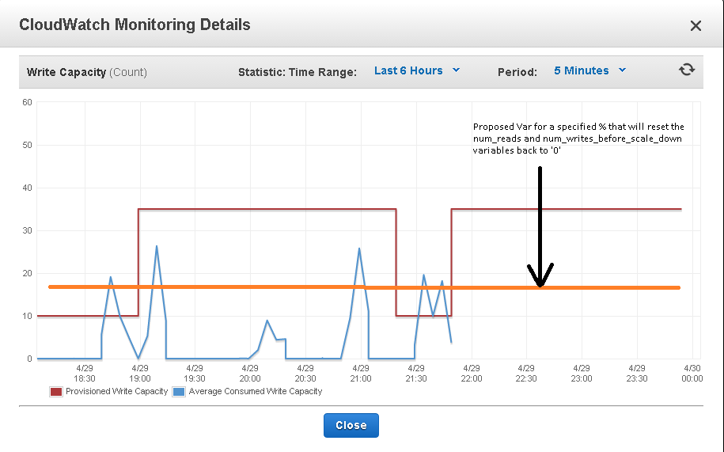

Release notes
=============

2.2.0
-----

**Release date:** 2015-10-23

- Circuit breaker a per-table/gsi config option (`#276 <https://github.com/sebdah/dynamic-dynamodb/issues/276>`). Thanks for the pull request `@Sazpaimon <https://github.com/Sazpaimon>`
- Fix minor spelling and formatting issues (`#278 <https://github.com/sebdah/dynamic-dynamodb/issues/278>`)

2.1.2
-----

**Release date:** 2015-10-05

- Fix the lower_threshold checking (`#275 <https://github.com/sebdah/dynamic-dynamodb/issues/275>`). Thanks for the pull request `@KyleAlanDavis <https://github.com/KyleAlanDavis>`

2.1.1
-----

**Release date:** 2015-10-02

- Depend on argparse for Python 2.6 (`#274 <https://github.com/sebdah/dynamic-dynamodb/issues/274>`)
- Fix import of ordered dicts for Python 2.6 (`#273 <https://github.com/sebdah/dynamic-dynamodb/issues/273>`). Thanks for the pull request `@KyleAlanDavis <https://github.com/KyleAlanDavis>`
- Fix upscaling reads and writes for GSI (`#271 <https://github.com/sebdah/dynamic-dynamodb/issues/271>`). Thanks for the pull request `@qqshfox <https://github.com/qqshfox>`

2.1.0
-----

**Release date:** 2015-09-30

- Support for granular downscaling (`#263 <https://github.com/sebdah/dynamic-dynamodb/issues/263>`). Thanks for the pull request `@Sazpaimon <https://github.com/Sazpaimon>`
- Allow configurable lookback period instead of the hardcoded 5 minute one (`#261 <https://github.com/sebdah/dynamic-dynamodb/issues/261>`). Thanks for the pull request `@Sazpaimon <https://github.com/Sazpaimon>`
- Don't scale down if it would scale below the current consumed units (`#268 <https://github.com/sebdah/dynamic-dynamodb/issues/261>`). Thanks for the pull request `@Sazpaimon <https://github.com/Sazpaimon>`

2.0.2
-----

**Release date:** 2015-09-30

- Use HTTP rather than SSH for git clone (`#266 <https://github.com/sebdah/dynamic-dynamodb/issues/266>`). Thanks for the pull request `@superprat <https://github.com/superprat>`

2.0.1
-----

**Release date:** 2015-09-29

- Fix value error when logging floats (`#265 <https://github.com/sebdah/dynamic-dynamodb/issues/265>`)
- Fix installation on Python < 2.7 (`#260 <https://github.com/sebdah/dynamic-dynamodb/issues/260>`). Thanks for the pull request `@Sazpaimon <https://github.com/Sazpaimon>`

2.0.0
-----

**Release date:** 2015-08-26

- Match each table to at most one config section (`#250 <https://github.com/sebdah/dynamic-dynamodb/issues/250>`). Thanks for the pull request `@memory <https://github.com/memory>`
- Granular up-scaling and new scaling metrics (`#252 <https://github.com/sebdah/dynamic-dynamodb/issues/250>`). Thanks for the pull request `@omnidavez <https://github.com/omnidavez>`

Please note that this change is not backwards compatible due to the nature of `#250 <https://github.com/sebdah/dynamic-dynamodb/issues/250>`. Though it is in a minority of use cases, it may in some cases break existing configuration. Details can be found in the pull request `#251 <https://github.com/sebdah/dynamic-dynamodb/issues/251>`

1.20.6
------

**Release date:** 2015-06-02

- Logging an AccessDeniedException in dynamodb.update_table_provisioning causing a KeyError (`#247 <https://github.com/sebdah/dynamic-dynamodb/issues/247>`__)

1.20.5
------

**Release date:** 2015-04-25

- Update cloudformation template to work around pip permissions issue (`#238 <https://github.com/sebdah/dynamic-dynamodb/issues/238>`__). Thanks for the pull request `@jasonrdsouza <https://github.com/jasonrdsouza>`__

1.20.4
------

**Release date:** 2015-03-17

- Does not scale down when one of the provisoned values is already at the lowest limit (`#237 <https://github.com/sebdah/dynamic-dynamodb/pull/237>`__). Thanks for the pull request `@lcabral37 <https://github.com/lcabral37>`__

1.20.3
------

**Release date:** 2015-02-17

- Bug in percent calculation for CUs (`#235 <https://github.com/sebdah/dynamic-dynamodb/issues/235>`__)

1.20.2
------

**Release date:** 2014-12-23

- Output failed to show floats and crashed the daemon (`#229 <https://github.com/sebdah/dynamic-dynamodb/issues/229>`__). Thanks `@nickveenhof <https://github.com/nickveenhof>`__ for the pull request.

1.20.1
------

**Release date:** 2014-12-22

- Updated retrying version to 1.3.3 (`#218 <https://github.com/sebdah/dynamic-dynamodb/issues/218>`__)

1.20.0
------

**Release date:** 2014-12-22

- Faster Up-scaling Based on Consumed Read/Write (`#227 <https://github.com/sebdah/dynamic-dynamodb/issues/227>`__)

Thanks `@pragnesh <https://github.com/pragnesh>`__ for the help with this release

1.19.2
------

**Release date:** 2014-11-29

- Remove 100% increase limit in configuration validation (`#225 <https://github.com/sebdah/dynamic-dynamodb/issues/225>`__)

1.19.1
------

**Release date:** 2014-11-19

- Fixed bug when disabling read and writes up/down scaling separately (`#221 <https://github.com/sebdah/dynamic-dynamodb/issues/221>`__)

1.19.0
------

**Release date:** 2014-10-16

- Support for DynamoDBs new flexible scaling (`#207 <https://github.com/sebdah/dynamic-dynamodb/issues/207>`__)
- Fixed a bug with consecutive checks for GSIs (`#206 <https://github.com/sebdah/dynamic-dynamodb/issues/206>`__)
- Typo in log message when auto scaling of table writes was disabled (`#209 <https://github.com/sebdah/dynamic-dynamodb/issues/209>`__)

1.18.5
------

**Release date:** 2014-09-26

- Weird behavior when a single table is matched by multiple regexes (`#203 <https://github.com/sebdah/dynamic-dynamodb/issues/203>`__)

1.18.4
------

**Release date:** 2014-09-25

- Tables should automatically scale up if below their minimums (`#202 <https://github.com/sebdah/dynamic-dynamodb/issues/202>`__)

1.18.3
------

**Release date:** 2014-08-04

- Throttling up scaling was ignored if a regular down scale occurred (`#198 <https://github.com/sebdah/dynamic-dynamodb/issues/198>`__)
- Read config setting used in wrong situation for GSIs (`#199 <https://github.com/sebdah/dynamic-dynamodb/issues/199>`__)

1.18.2
------

**Release date:** 2014-07-23

- Throughput alarms does not honor lookback windows (`#197 <https://github.com/sebdah/dynamic-dynamodb/issues/197>`__)

1.18.1
------

**Release date:** 2014-07-18

- Incorrect division in consumption calculation (`#195 <https://github.com/sebdah/dynamic-dynamodb/issues/195>`__)

1.18.0
------

**Release date:** 2014-07-17

- Make the CloudWatch lookback window start point configurable (`#192 <https://github.com/sebdah/dynamic-dynamodb/issues/192>`__)
- Make it possible to turn on and off up-scaling or down-scaling (`#147 <https://github.com/sebdah/dynamic-dynamodb/issues/147>`__)
- Enhance boto logging for GSI errors (`#194 <https://github.com/sebdah/dynamic-dynamodb/issues/194>`__)
- Automatically bump the doc version (`#191 <https://github.com/sebdah/dynamic-dynamodb/issues/191>`__)

1.17.0
------

**Release date:** 2014-06-23

- No credentials needed in the CloudFormation template, an IAM Instance Profile will be automatically created
- The CloudFormation template will now launch Amazon Linux 2014.03.1 AMIs
- Minor fixes to make the CloudFormation template work smoother
- Fallback to use boto authentication (`#188 <https://github.com/sebdah/dynamic-dynamodb/issues/188>`__)
- Handle logging configuration exceptions (`#189 <https://github.com/sebdah/dynamic-dynamodb/issues/189>`__)

1.16.0
------

**Release date:** 2014-06-11

- SNS notifications when throughput thresholds are exeeded. (`#174 <https://github.com/sebdah/dynamic-dynamodb/issues/174>`__). Thanks (`@Jofen <https://github.com/Jofen>`__) for the pull request!

1.15.1
------

**Release date:** 2014-06-05

- Locked ``boto`` version to 2.28.0 (`#183 <https://github.com/sebdah/dynamic-dynamodb/issues/183>`__)

1.15.0
------

**Release date:** 2014-06-02

- Default options for tables and GSIs is now supported using the `[default_options]` section (`#181 <https://github.com/sebdah/dynamic-dynamodb/issues/181>`__)

1.14.0
------

**Release date:** 2014-05-21

A special thanks to (`@ulsa <https://github.com/ulsa>`__) for his help with this release.

- Document SNS permission requirements (`#171 <https://github.com/sebdah/dynamic-dynamodb/issues/171>`__)
- Wrong region in log message for instance profile authentication (`#170 <https://github.com/sebdah/dynamic-dynamodb/issues/170>`__)
- Improved logging for daemon commands (`#165 <https://github.com/sebdah/dynamic-dynamodb/issues/165>`__). Pull request from `@ulsa <https://github.com/ulsa>`__
- Removed inconsistent debug printout (`#164 <https://github.com/sebdah/dynamic-dynamodb/issues/164>`__). Pull request from `@ulsa <https://github.com/ulsa>`__
- Fixed some minor doc issues (`#172 <https://github.com/sebdah/dynamic-dynamodb/issues/172>`__). Pull request from `@ulsa <https://github.com/ulsa>`__
- Added column for default values (`#173 <https://github.com/sebdah/dynamic-dynamodb/issues/173>`__). Pull request from `@ulsa <https://github.com/ulsa>`__
- Fixed issues with docs for command-line options (`#176 <https://github.com/sebdah/dynamic-dynamodb/issues/176>`__). Pull request from `@ulsa <https://github.com/ulsa>`__
- Implement max retry count for CloudWatch metrics fetching (`#178 <https://github.com/sebdah/dynamic-dynamodb/issues/178>`__)
- throttled-reads-upper-threshold is documented as being a percentage; actually a count (`#169 <https://github.com/sebdah/dynamic-dynamodb/issues/169>`__)
- Catch permission denied when creating pid file (`#167 <https://github.com/sebdah/dynamic-dynamodb/issues/167>`__)
- No error message when having insufficient IAM permissions (`#166 <https://github.com/sebdah/dynamic-dynamodb/issues/166>`__)
- Docs for -t incorrect (`#161 <https://github.com/sebdah/dynamic-dynamodb/issues/161>`__)
- Create example IAM policy (`#177 <https://github.com/sebdah/dynamic-dynamodb/issues/177>`__)

1.13.1
------

**Release date:** 2014-05-16

- Bugfix: Fix a few provisioning update issues (`#160 <https://github.com/sebdah/dynamic-dynamodb/issues/160>`__). Thanks (`@Jofen <https://github.com/Jofen>`__) for the pull request!

1.13.0
------

**Release date:** 2014-05-08

A special thanks to (`@johnbartels <https://github.com/johnbartels>`__) for his help with the consecutive checks feature.

- It is now possible to scale down after `x` consecutive checks where Dynamic DynamoDB have seen a need for scaling down. This will make it even easier to target the times during the day where you want to scale down. See the ``num-read-checks-before-scale-down`` and ``num-write-checks-before-scale-down`` options. (`#148 <https://github.com/sebdah/dynamic-dynamodb/issues/148>`__)
- In addition to the consecutive checks feature we have support for resetting the consecutive checks counter on certain consumption percentages using ``num-read-checks-reset-percent`` and ``num-write-checks-reset-percent``. In the example below we would be able to avoid the second scale down by setting a reset percentage that was slightly higher than the consumption spikes.

- You can now run Dynamic DynamoDB once instead of looping using the ``--run-once`` command line option (`#152 <https://github.com/sebdah/dynamic-dynamodb/issues/152>`__)
- Merged pull request: Fixed regex wildcard example (`#151 <https://github.com/sebdah/dynamic-dynamodb/issues/151>`__) by (`@tayl0r <https://github.com/tayl0r>`__)
- Merged pull request: Fix log message when autoscaling of writes has been disabled (`#150 <https://github.com/sebdah/dynamic-dynamodb/issues/150>`__) by (`@alexkuang <https://github.com/alexkuang>`__)

1.12.1
------

**Release date:** 2014-04-28

- Fixed reading of wrong config options

1.12.0
------

**Release date:** 2014-04-26

- Scaling up will now be allowed even outside maintenance windows (`#138 <https://github.com/sebdah/dynamic-dynamodb/issues/138>`__)
- Reduced code duplication between GSI and table scaling. Implemented some tests for the core calculatations (`#139 <https://github.com/sebdah/dynamic-dynamodb/issues/139>`__)

1.11.0
------

**Release date:** 2014-04-14

- You can now turn on and off scaling for reads and writes separately (`#137 <https://github.com/sebdah/dynamic-dynamodb/issues/137>`__)
- Make it possible to set pid file location (`#146 <https://github.com/sebdah/dynamic-dynamodb/issues/146>`__)

1.10.7
------

**Release date:** 2014-04-01

- Implemented back off strategy when retrieving CloudWatch metrics (`#134 <https://github.com/sebdah/dynamic-dynamodb/issues/134>`__)

1.10.6
------

**Release date:** 2014-04-01

- Fixed config parsing (`#143 <https://github.com/sebdah/dynamic-dynamodb/issues/143>`__)

1.10.4 + 1.10.5
---------------

**Release date:** 2014-03-31

- Fixed issue with throtting that overrides regular scaling rules (`#142 <https://github.com/sebdah/dynamic-dynamodb/issues/142>`__)

1.10.3
------

**Release date:** 2014-03-31

- Fixed bug in default option parsing for GSIs (`#141 <https://github.com/sebdah/dynamic-dynamodb/issues/141>`__)

1.10.2
------

**Release date:** 2014-03-29

- Throttling should only be checked for if explicitly configured (`#135 <https://github.com/sebdah/dynamic-dynamodb/issues/135>`__)
- Catching exception in metrics fetching (`#134 <https://github.com/sebdah/dynamic-dynamodb/issues/134>`__)
- `always-decrease-rw-together` blocked scaling up (`#133 <https://github.com/sebdah/dynamic-dynamodb/issues/133>`__)

1.10.1
------

**Release date:** 2014-03-24

- Fixed typo in SNS notification subjects
- Merged GSI fixes (`#131 <https://github.com/sebdah/dynamic-dynamodb/issues/131>`__)
- Updated readme with IAM information (`#132 <https://github.com/sebdah/dynamic-dynamodb/issues/132>`__)

1.10.0
------

**Release date:** 2014-03-21

- Added support for SNS notifications when Dynamic DynamoDB updates table provisioning (`#104 <https://github.com/sebdah/dynamic-dynamodb/issues/104>`__)
- Dynamic DynamoDB can now authenticate using EC2 instance profiles (`#128 <https://github.com/sebdah/dynamic-dynamodb/issues/128>`__)
- Enhanced error handling of unknown exceptions
- Bug fix: ``check-interval`` was not properly set when restarting the daemon (`#130 <https://github.com/sebdah/dynamic-dynamodb/issues/130>`__)

1.9.1
-----

**Release date:** 2014-03-17

- `Daemon mode does not reload the table / GSI lists #127 <https://github.com/sebdah/dynamic-dynamodb/issues/127>`__
- `dynamic-dynamodb crashes when a DynamoDB table is deleted during execution #126 <https://github.com/sebdah/dynamic-dynamodb/issues/126>`__
- `Catch invalid regular expressions in the configuration #125 <https://github.com/sebdah/dynamic-dynamodb/issues/125>`__

1.9.0
-----

**Release date:** 2014-03-07

- `Introducing support for throttled request mitigation #120 <https://github.com/sebdah/dynamic-dynamodb/issues/120>`__. Many thanks to `@msh9 <https://github.com/msh9>`__ for his pull request!

1.8.3
-----

**Release date:** 2014-02-27

- Fixes in configuration and CloudFormation template

1.8.2
-----

**Release date:** 2014-02-21

- `The dyn-run tag is not visible in log files #120 <https://github.com/sebdah/dynamic-dynamodb/issues/120>`__

1.8.1
-----

**Release date:** 2014-02-20

- `Python dictConfig is not available in Python 2.6 #119 <https://github.com/sebdah/dynamic-dynamodb/issues/119>`__

1.8.0
-----

**Release date:** 2014-02-19

- `Add support for external logging configuration file #74 <https://github.com/sebdah/dynamic-dynamodb/issues/74>`__
- `logging through syslog #49 <https://github.com/sebdah/dynamic-dynamodb/issues/49>`__

1.7.3
-----

**Release date:** 2014-01-28

-  `circuit breaker option bailing out w/ exception #105 <https://github.com/sebdah/dynamic-dynamodb/issues/105>`__

1.7.2
-----

**Release date:** 2014-01-23

-  `CU increases fail if decreases fail due to exceeded limits #103 <https://github.com/sebdah/dynamic-dynamodb/issues/103>`__

1.7.1
-----

**Release date:** 2014-01-04

-  `Rounding increase values up #100 <https://github.com/sebdah/dynamic-dynamodb/issues/100>`__
-  `Fixed bug with configuration for multiple tables #101 <https://github.com/sebdah/dynamic-dynamodb/issues/100>`__. Thanks `@msh9 <https://github.com/msh9>`__!

1.7.0
-----

**Release date:** 2013-12-26

-  `Added support for global secondary indexes #73 <https://github.com/sebdah/dynamic-dynamodb/issues/73>`__
-  Fixed `Log level configuration in configuration file is overridden #75 <https://github.com/sebdah/dynamic-dynamodb/issues/75>`__
-  `Recursively retrieve all tables #84 <https://github.com/sebdah/dynamic-dynamodb/issues/84>`__. Submitted by `@alxmrtn <https://github.com/alxmrtn>`__
-  `Loop dynamic-dynamodb in command line mode #91 <https://github.com/sebdah/dynamic-dynamodb/issues/91>`__
-  `Migrated to ``boto.dynamodb2`` #72 <https://github.com/sebdah/dynamic-dynamodb/issues/72>`__
-  `Describe configuration options in the documentation #80 <https://github.com/sebdah/dynamic-dynamodb/issues/80>`__
-  `Move release notes to the documentation #79 <https://github.com/sebdah/dynamic-dynamodb/issues/79>`__
- Better exception handling fixed in `#96 <https://github.com/sebdah/dynamic-dynamodb/issues/96>`__, `#97 <https://github.com/sebdah/dynamic-dynamodb/issues/97>`__ and `#98 <https://github.com/sebdah/dynamic-dynamodb/issues/98>`__
-  `Silently skipping configured tables that does not exist in DynamoDB #94 <https://github.com/sebdah/dynamic-dynamodb/issues/94>`__
- Enhanced `configuration validation #93 <https://github.com/sebdah/dynamic-dynamodb/issues/93>`__

A full list of closed issues can be found `here <https://github.com/sebdah/dynamic-dynamodb/issues?milestone=29&page=1&state=closed>`__

Special thanks to the AWS DynamoDB for their support with this release.

1.6.0
-----

**Release date:** 2013-11-21

-  Documented project in Sphinx -
   http://dynamic-dynamodb.readthedocs.org
-  Fixed `Failure on non-matching regular expressions
   #69 <https://github.com/sebdah/dynamic-dynamodb/issues/69>`__
-  Fixed bug `cleanup logs in case of noop updates
   #71 <https://github.com/sebdah/dynamic-dynamodb/issues/71>`__ -
   Thanks [@tmorgan](https://github.com/tmorgan)

1.5.8
-----

**Release date:** 2013-10-18

-  Fixed bug `Under some circumstances Dynamic DynamoDB crashes when
   table is deleted
   #68 <https://github.com/sebdah/dynamic-dynamodb/issues/68>`__

1.5.7
-----

**Release date:** 2013-10-17

-  Closed `Support for running dynamic-dynamodb with supervisord
   #66 <https://github.com/sebdah/dynamic-dynamodb/issues/66>`__ with
   `Pull Request
   #67 <https://github.com/sebdah/dynamic-dynamodb/pull/67>`__. Thanks
   @pragnesh!

1.5.6
-----

**Release date:** 2013-10-06

-  `Fixed issue where DDB didn't support increasing capacity two times
   #65 <https://github.com/sebdah/dynamic-dynamodb/pull/65>`__

1.5.5
-----

**Release date:** 2013-08-31

-  `Change log level of informational
   message <https://github.com/sebdah/dynamic-dynamodb/issues/62>`__

1.5.4
-----

**Release date:** 2013-08-29

-  `Added missing ``key_name``
   parameter <https://github.com/sebdah/dynamic-dynamodb/issues/60>`__

1.5.3
-----

**Release date:** 2013-08-27

-  `Added missing sleep statement
   fixes <https://github.com/sebdah/dynamic-dynamodb/issues/58>`__

1.5.2
-----

**Release date:** 2013-08-27

-  `Issue with ``always-decrease-rw-together``
   option <https://github.com/sebdah/dynamic-dynamodb/issues/55>`__
-  `ListTables permission
   required <https://github.com/sebdah/dynamic-dynamodb/issues/57>`__

The AWS ``ListTables`` permission is no longer a hard requirement. It's
only needed if you're using regular expressions to configure your
DynamoDB tables.

1.5.1
-----

**Release date:** 2013-08-22

-  `No module named
   core <https://github.com/sebdah/dynamic-dynamodb/issues/53>`__ (fixed
   by `#54 <https://github.com/sebdah/dynamic-dynamodb/pull/54>`__)

Fixed bug in the 1.5.0 release.

1.5.0
-----

**Release date:** 2013-08-22

-  `Support for regular expressions in
   config <https://github.com/sebdah/dynamic-dynamodb/issues/52>`__

Thanks [@pragnesh](https://github.com/pragnesh) for adding this feature!

1.4.0
-----

**Release date:** 2013-08-14

-  `Retrying failed DynamoDB
   connections <https://github.com/sebdah/dynamic-dynamodb/issues/51>`__

1.3.6
-----

**Release date:** 2013-07-21

-  `int() argument must be a string or a number, not 'NoneType'
   (#50) <https://github.com/sebdah/dynamic-dynamodb/issues/50>`__

1.3.5
-----

**Release date:** 2013-06-17

-  `increase\_writes\_unit parameter is used while it should be
   decrease\_writes\_unit
   (#47) <https://github.com/sebdah/dynamic-dynamodb/issues/47>`__

1.3.4
-----

**Release date:** 2013-06-13

-  `An attempt to update provisioning is made even if the requested
   values are equal to the tables current values
   (#46) <https://github.com/sebdah/dynamic-dynamodb/issues/46>`__

1.3.3
-----

**Release date:** 2013-06-08

-  `Increasing to a minimum provisioned throughput value doesn't take
   into account the current table's throughput
   (#45) <https://github.com/sebdah/dynamic-dynamodb/issues/45>`__
-  `dynamic-dynamodb --version causes AttributeError in cli
   (#44) <https://github.com/sebdah/dynamic-dynamodb/issues/44>`__

1.3.2
-----

**Release date:** 2013-05-14

-  `increase\_reads\_in\_percent calculations are incorrect
   (#40) <https://github.com/sebdah/dynamic-dynamodb/issues/40>`__

1.3.1
-----

**Release date:** 2013-05-10

-  `Fix Python 2.6 support
   (#39) <https://github.com/sebdah/dynamic-dynamodb/issues/39>`__

1.3.0
-----

**Release date:** 2013-05-01

This Dynamic DynamoDB release makes it possible to use multiple Dynamic
DynamoDB instances in parallel in daemon mode. Simply use the
``--instance`` flag to separate the difference instances with a unique
name. Then control them as usual with the ``--daemon`` flag.

-  `Allow to run multiple instances in parallel
   (#37) <https://github.com/sebdah/dynamic-dynamodb/issues/37>`__

1.2.5
-----

**Release date:** 2013-04-29

-  `Handle ResourceInUseException better
   (#36) <https://github.com/sebdah/dynamic-dynamodb/issues/36>`__
-  `Add --log-level option to command line
   (#34) <https://github.com/sebdah/dynamic-dynamodb/issues/34>`__

1.2.4
-----

**Release date:** 2013-04-26

-  `Mix up between percent and units
   (#35) <https://github.com/sebdah/dynamic-dynamodb/issues/35>`__
-  Broken build fixed

1.2.0
-----

**Release date:** 2013-04-20

-  `Add support for dead-man's-switch API call
   (#25) <https://github.com/sebdah/dynamic-dynamodb/issues/25>`__

1.1.0
-----

**Release date:** 2013-04-17

-  `Update provisioning in units not just percentage
   (#22) <https://github.com/sebdah/dynamic-dynamodb/issues/22>`__
-  `Increase in percent does not add to current provisioning properly
   (#33) <https://github.com/sebdah/dynamic-dynamodb/issues/33>`__
-  `Enhance configuration option validation
   (#32) <https://github.com/sebdah/dynamic-dynamodb/issues/32>`__

1.0.1
-----

**Release date:** 2013-04-17

-  Minor fix: Ugly output removed

1.0.0
-----

**Release date:** 2013-04-16

The 1.0.0 release is a leap forward when it comes to module structure
and extendability. Please remember that this is still Release in beta in
PyPI, so all bug reports are very welcome. File any odd behavior or bugs
in `GitHub
Issues <https://github.com/sebdah/dynamic-dynamodb/issues>`__.

-  `Restructure the Dynamic DynamoDB code base
   (#30) <https://github.com/sebdah/dynamic-dynamodb/issues/30>`__
-  `Support multiple tables in one configuration file
   (#19) <https://github.com/sebdah/dynamic-dynamodb/issues/19>`__
-  `Change pid file name
   (#31) <https://github.com/sebdah/dynamic-dynamodb/issues/31>`__
-  `Handle combinations of configuration file and command line options
   better
   (#24) <https://github.com/sebdah/dynamic-dynamodb/issues/24>`__

0.5.0
-----

**Release date:** 2013-04-12

-  `Add --log-file command line option
   (#20) <https://github.com/sebdah/dynamic-dynamodb/issues/20>`__
-  `Allow scale down at 0% consumed count
   (#17) <https://github.com/sebdah/dynamic-dynamodb/issues/17>`__
-  `"only downscale reads AND writes" option would be useful
   (#23) <https://github.com/sebdah/dynamic-dynamodb/issues/23>`__

0.4.2
-----

**Release date:** 2013-04-11

-  `Unhandled exception: ValidationException
   (#28) <https://github.com/sebdah/dynamic-dynamodb/issues/28>`__
-  `Handle DynamoDB provisioning exceptions cleaner
   (#29) <https://github.com/sebdah/dynamic-dynamodb/issues/29>`__

0.4.1
-----

**Release date:** 2013-04-10

-  `No logging in --daemon mode
   (#21) <https://github.com/sebdah/dynamic-dynamodb/issues/21>`__

0.4.0
-----

**Release date:** 2013-04-06

-  `Support for daemonizing Dynamic DynamoDB
   (#11) <https://github.com/sebdah/dynamic-dynamodb/issues/11>`__
-  `Enhanced logging options
   (#4) <https://github.com/sebdah/dynamic-dynamodb/issues/4>`__
-  `Add --version flag to dynamic-dynamodb command
   (#18) <https://github.com/sebdah/dynamic-dynamodb/issues/18>`__

0.3.5
-----

**Release date:** 2013-04-05

-  `Handle missing table exceptions
   (#12) <https://github.com/sebdah/dynamic-dynamodb/issues/12>`__
-  Bug fix: `No upscaling happening when scaling limit is exceeded
   (#16) <https://github.com/sebdah/dynamic-dynamodb/issues/16>`__

0.3.4
-----

**Release date:** 2013-04-05

-  Bug fix: `Min/max limits seems to be read improperly from
   configuration files
   (#15) <https://github.com/sebdah/dynamic-dynamodb/issues/15>`__

0.3.3
-----

**Release date:** 2013-04-05

-  Bug fix: `Mixup of read and writes provisioing in scaling
   (#14) <https://github.com/sebdah/dynamic-dynamodb/issues/14>`__

0.3.2
-----

**Release date:** 2013-04-05

-  Bug fix: `Improper scaling under certain circumstances
   (#13) <https://github.com/sebdah/dynamic-dynamodb/issues/13>`__

0.3.1
-----

**Release date:** 2013-04-04

-  Bug fix: `ValueError: Unknown format code 'd' for object of type
   'str' (#10) <https://github.com/sebdah/dynamic-dynamodb/issues/10>`__

0.3.0
-----

**Release date:** 2013-03-27

This release contains support for configuration files, custom AWS access
keys and configurable maintenance windows. The maintenance feature will
restrict Dynamic DynamoDB to change your provisioning only during
specific time slots.

-  `Add support for configuration files
   (#6) <https://github.com/sebdah/dynamic-dynamodb/issues/6>`__
-  `Configure AWS credentials on command line
   (#5) <https://github.com/sebdah/dynamic-dynamodb/issues/5>`__
-  `Support for maintenance windows
   (#1) <https://github.com/sebdah/dynamic-dynamodb/issues/1>`__

0.2.0
-----

**Release date:** 2013-03-24 - First public release

0.1.1
-----

**Release date:** 2013-03-24 - Initial release
